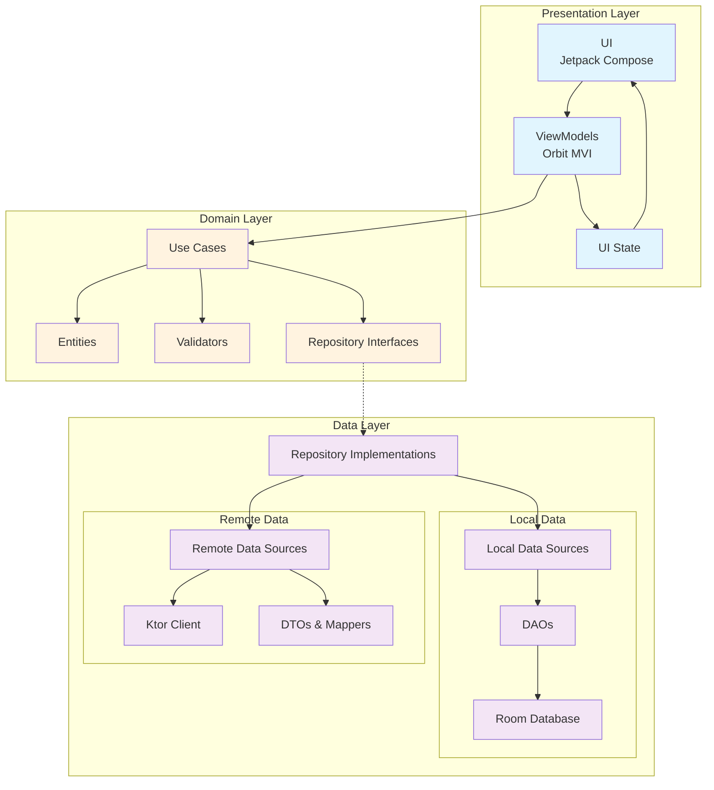
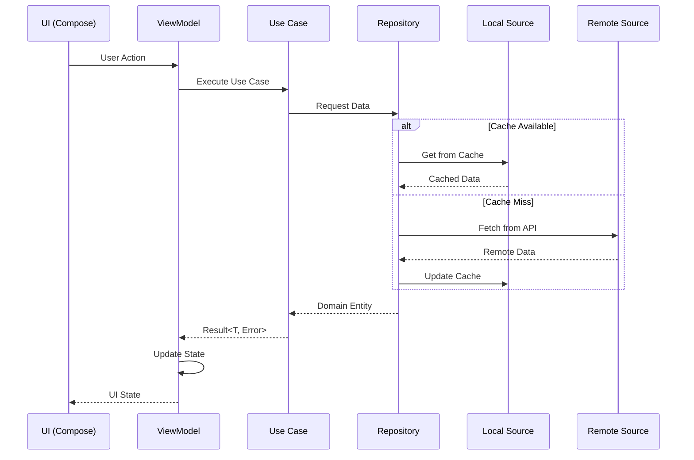

# Messenger
[](https://codecov.io/gh/timurgilfanov/messenger)


Showcase project demostrating approach to build a large-scale Android application with maintainable codebase and scalable architecture using Kotlin and Jetpack Compose.

## 🏗️ Architecture

This project follows **Clean Architecture** principles including **Dependency Injection**, and **MVI** architecture for UI.



### Data Flow



### Key Architectural Decisions

- **Clean Architecture**: Ensures testability, maintainability, and scalability
- **MVI**: Provides predictable state management with clear side effects handling
- **Domain-Driven Design**: Rich domain models with business logic encapsulation
- **Repository Pattern**: Abstracts data sources and provides single source of truth
- **Result Pattern**: Type-safe error handling without exceptions
- **Dependency Injection**: Using Hilt for compile-time safety and testability

## 🚀 Quick Start

```bash
# Run all pre-commit checks (formatting, linting, architecture tests, unit & component tests)
./gradlew preCommit

# Run specific test categories
./gradlew testMockDebugUnitTest -PtestCategory=timur.gilfanov.messenger.annotations.Unit
./gradlew connectedMockDebugAndroidTest -Pannotation=timur.gilfanov.messenger.annotations.FeatureTest 

# Generate coverage report
./gradlew koverXmlReportMockDebug
```

## 📱 Features

- Offline-first architecture
- Delta synchronization for efficient data updates
- Comprehensive error handling with typed errors

## 🛠️ Tech Stack

- **Language**: Kotlin 2.2.0
- **UI**: Jetpack Compose (BOM 2025.07.00)
- **Architecture**: Clean Architecture + MVI
- **DI**: Hilt 2.57
- **Database**: Room 2.7.2
- **Networking**: Ktor 3.2.3
- **Testing**: JUnit4, Turbine, Robolectric, Roborazzi
- **Code Quality**: Detekt, Ktlint, Konsist

## 📊 Testing Strategy

Comprehensive testing pyramid with 6 test categories. See [Testing Strategy](https://github.com/timurgilfanov/messenger/blob/main/docs/Testing%20Strategy.md) for details.

| Category     | Coverage Target   | Execution            |
|--------------|-------------------|----------------------|
| Architecture | Rules enforcement | Every commit         |
| Unit         | 80%+              | Every commit         |
| Component    | 70%+              | Every commit         |
| Screenshot   | All UI components | Pre-merge            |
| Feature      | 50%+              | Pre-merge            |
| Application  | 40%+              | Pre-merge/Post-merge |

### 📸 Screenshot Testing

Visual regression testing for UI components using **Roborazzi + Robolectric**:

```bash
# Verify screenshots match baselines
./gradlew verifyRoborazziMockDebug

# Update screenshot baselines  
./gradlew recordRoborazziMockDebug

# Check screenshot directory size (50MB limit)
./gradlew checkScreenshotSize
```

**CI Integration:**
- PRs automatically verify screenshots and upload diffs as artifacts
- Apply `update-screenshots` label to auto-update baselines in PR branch
- Size limit enforced via `./gradlew preCommit`

See [Screenshot Testing docs](docs/Screenshot%20Testing.md) for details.
