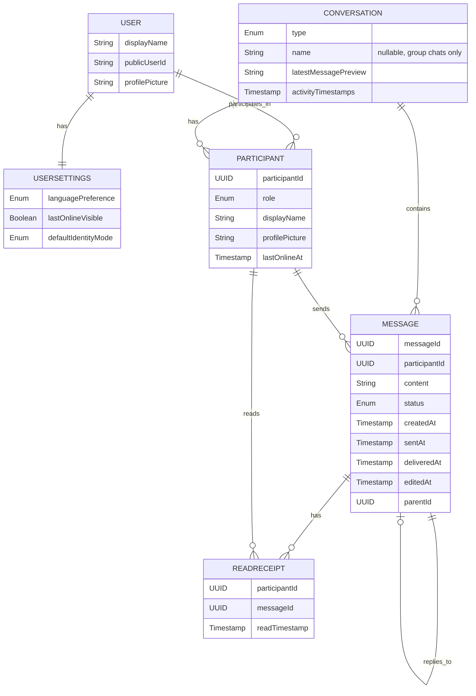

# Overview
## Scope
Mobile client for 1-to-1 and group conversations with text.
## Out-of-scope
- attachments
- reactions
- channels
- backend requirements

# Business requirements

## Chat management

### Capabilities
- Users can see list of their chats.
- Users can create a new 1-to-1 chat with another user.
- Users can create a group chat with one or more other users.
- Users can delete a 1-to-1 chat (for self only).
- Users can join an existing group chat via an invite link.
- Admins and moderators can add participants to a group chat directly.
- Users can leave a group chat.
- Users can search for and select participants from their device contacts who have an account in the application.

### Rules
- Only one 1-to-1 conversation may exist between two users.
- Chats must be ordered by most recent message.
- Deleting a 1-to-1 chat removes it only from the deleter's chat list; the other participant still sees the conversation.
- Group chats cannot be deleted; participants can only leave.
- Group chats must have a name between 1 and 128 characters.
- Group chats must have at least one and at most 1000 participants.

## Chat

### Capabilities
- Users can read messages.
- Users can create messages.
- Users can see who sent a message and when.
- Users can see per-message read receipts from each participant.
- Users can reply to the message.
- Users can see when a message failed to send.
- Users can retry sending a failed message.
- Users must see the same messages on all devices associated with their account.
- Users can see when other participants were last online.
- Users can load older messages by scrolling up in a conversation.
- Users can search for messages within a conversation.

### Rules
- Messages must not be blank.
- Message text must be less than or equal to 2000 characters.

## Group chat administration

### Capabilities
- The user who creates a group chat becomes its admin.
- Admins can promote participants to moderator or admin.
- Admins can remove participants from a group chat.
- Moderators can remove non-admin participants from a group chat.

### Rules
- A group chat must always have at least one admin.
- When the last remaining admin attempts to leave, the action must be rejected until the admin promotes another participant to admin.
- Only admins can change the group chat name.

## Message modification

### Capabilities
- Users can edit own messages.
- Users can see when a message was edited.
- Users can delete own messages ("delete for me" or "delete for everyone").
- In group chats, admins and moderators can delete any participant's messages ("delete for everyone" only).

### Rules
- "Delete for me" removes the message only from the deleting user's view.
- "Delete for everyone" replaces the message with a "deleted" placeholder visible to all participants.

## Offline capabilities

### Capabilities
- Users can read, create, edit, and delete messages offline.

## Push notifications

### Capabilities
- Users receive push notifications for new messages when the app is in the background.
- Users can mute notifications for specific conversations.

### Rules
- Notifications must not reveal message content on the lock screen unless the user has enabled content preview.
- Muted conversations must not generate push notifications.

## Privacy

### Rules
- Only participants of a conversation must be able to access its messages.
- Users' communications circle and usage patterns must not be exposed or inferable to other users or external observers through the application.
- The application must guarantee that users who use per-conversation identity, disable last-online visibility, and do not set a public user ID are not identifiable across different conversations by other participants.

## Privacy settings

### Capabilities
- Users can choose whether to use their global profile name and picture or a per-conversation identity in group chats.
- Users can disable last-online visibility for other participants.

### Rules
- Per-conversation identity is independent of the user's global profile and is visible only within that conversation.
- 1-to-1 chats always use the global profile.

## Blocking

### Capabilities
- Users can block other users.
- Users can unblock previously blocked users.
- Users can view a list of blocked users.

### Rules
- Blocked users cannot send messages to the blocking user in 1-to-1 chats.
- Blocked users cannot be added to new conversations by the blocking user.
- Blocking does not remove existing group chat membership.
- Blocking does not hide or suppress messages in shared group chats; both users continue to see each other's messages within groups.
- Blocking is not visible to the blocked user.

## User profile

### Capabilities
- Users must log in to an account to use the application.
- Users can create an account.
- Users can log out of the application.
- Users must remain logged in across app restarts until they explicitly log out.
- Users can set a public user ID, a human-readable unique name for discovery by other users.
- Users can change their public user ID.
- Users must enter a profile name.
- Users can edit their profile name.
- Users can set a profile picture.
- Users can edit their profile picture.
- Users can delete their account.

### Rules
- Public user ID must be 3-32 characters, alphanumeric and underscores only.
- Public user ID must be unique across all users.
- Profile name must be 1-64 characters and must not be blank or whitespace-only.
- Account deletion must be rejected while the user is the sole admin of any group chat; the user must first promote another participant to admin.
- Account deletion must remove all user data from the server.
- Account deletion is irreversible.

## Localization

### Capabilities
- Users can select UI language between English and German.

# UX requirements

## Chat management

### Chats list
- Each chat in the chat list must display a preview of the latest message.
- Display a loading indicator until chats are loaded.
- Show cached chats if offline and indicate offline status.
- Display an error and retry option if loading fails.
- Chats previews must automatically update when new messages arrive.
- When a new message arrives or is created, the corresponding chat must move to the top of the chat list.
- Chats with unread messages must display a visual unread indicator.
- Chat list updates must not disrupt user interaction with the list.
- When the user has no chats, the interface must display an empty state explaining how to start a conversation.

### Chat creation
- The option to create a new chat must be clearly visible on the same screen with the chat list.
- Users must be able to choose between creating a 1-to-1 chat or a group chat.
- When creating a new chat, users must be able to search by profile name or public user ID, or select participants from a list of device contacts who have an account in the application.
- When creating a group chat, users must be able to select multiple participants and provide a group name.
- After a new chat is created, the interface must display the new chat in the chat list and navigate the user to the conversation.
- If a 1-to-1 chat already exists with the selected participant, the interface must notify the user and open the existing chat instead of creating a duplicate.
- If creating a new chat fails (e.g., network error or blocked participant), the interface must display a clear error message and allow the user to retry.

### Chat deletion
- Only 1-to-1 chats may be deleted; the delete option must not appear for group chats.
- When a chat is deleted, it must immediately disappear from the deleter's chat list.
- Users must receive confirmation before deleting a chat.

### Group chat management
- Group chats must display the group name and participant count in the chat list.
- Users must be able to view the list of participants in a group chat.
- Admins must be able to access group settings to change the group name or manage participants.
- Admins must be able to generate invite links for the group chat.
- When a user opens an invite link, the interface must show the group name and a confirmation before joining.
- When a participant is removed or leaves, remaining participants must see a system indication.
- When a new participant joins, existing participants must see a system indication.
- When the last admin attempts to leave, the interface must inform them that they must first promote another participant to admin.

## Chat

### Sending and delivery
- After a message is successfully added to the chat, the input field must be cleared.
- Messages created offline must remain visible in the conversation in a stable position until synchronization completes.
- Messages that fail to be delivered must remain visible in the chat with a failed status.

### Scrolling and incoming messages
- Incoming messages must not change the current scroll position when the user is viewing older messages.
- When the user is viewing the latest messages, incoming messages must automatically appear in view.
- When new messages arrive while the user is viewing older messages, the UI must indicate that new messages are available.

### Message display
- Edited messages must be visibly marked as edited.
- Replies must display an inline compact preview of the parent message above the reply text.
- Replying to a deleted message must show "original message deleted" in the preview.

### Read receipts
- In 1-to-1 chats, each message must show its read status (e.g., sent, delivered, read).
- In group chats, each message must show a read count; users can tap to see which participants have read the message.

### Message deletion
- When deleting a message, the user must be presented with a choice between "delete for me" and "delete for everyone".
- Messages deleted for everyone must display a "this message was deleted" placeholder.

### Message history loading
- When the user scrolls to the top of loaded messages, older messages must load automatically or via a visible trigger.
- A loading indicator must be shown while older messages are being fetched.
- Loading older messages must not change the current scroll position.

### Message search
- The search option must be accessible within the conversation screen.
- Search results must highlight matching text and allow the user to navigate to the message in context.
- If no results are found, the interface must display a clear empty state.

## Errors
- Blocking errors must provide a clear explanation of the problem.
- Blocking errors must provide an available action to resolve the issue when possible.
- Only one blocking error should be shown to the user at a time.
- Blocking errors must remain visible until the user explicitly dismisses them.
- Non-blocking errors should not interrupt the user's interaction with the UI.
- User input must not be lost when an error occurs.

## User profile

### Login
- The login screen must be presented when the user is not authenticated.
- Users must be able to enter their credentials and submit them to log in.
- If login fails, the interface must display a clear error message and allow the user to retry.
- After successful login, the interface must navigate the user to the chat list.

### Logout
- The logout option must be accessible from the settings or profile screen.
- Users must receive confirmation before logging out.
- After logout, the interface must navigate the user to the login screen.

### Account creation
- The login screen must provide an option to create a new account.
- Users must be able to enter a profile name and credentials to create an account.
- Users may optionally set a public user ID during account creation or later via profile settings.
- If account creation fails, the interface must display a clear error message and allow the user to retry.
- After successful account creation, the interface must navigate the user to the chat list.

### Profile display
- The profile screen must display the user's current name and profile picture.
- If no profile picture is set, a placeholder avatar must be displayed.

### Profile edit
- When the user edits the profile name or picture, the change must be visible immediately after a successful save.
- If saving profile changes fails, the entered data must remain visible and the user must be informed.
- While profile changes are being saved, the interface must prevent conflicting edits.
- When profile changes are successfully saved, the interface must provide confirmation.
- Profile name input must show validation feedback when the entered name is invalid.
- When the user selects a new profile picture, the preview must be shown before saving.
- When a user updates their profile name or picture, the change must become visible in chats and message lists without requiring the application to restart.

### Blocking
- The option to block a user must be accessible from the user's profile or conversation settings.
- The blocked users list must be accessible from settings.
- Users must receive confirmation before blocking or unblocking.

### Account deletion
- The option to delete the account must be accessible from settings.
- Users must receive confirmation before account deletion with a clear warning that the action is irreversible.
- If the user is the sole admin of any group chat, the interface must list those chats and inform the user to transfer adminship before deletion can proceed.
- After account deletion, the interface must navigate the user to the login screen.

## Localization
- The option to select a UI language must be clearly accessible in the settings or profile screen.
- When the user selects a new language, the interface must update immediately without requiring an app restart.
- The selected language must persist across app restarts and be applied on all devices associated with the account.
- If a string is not available in the selected language, the interface must display a fallback language (e.g., English) rather than showing an empty or broken string.
- UI must handle different text lengths and formatting correctly for the selected language (e.g., longer words in German must not break layout).

## Privacy settings
- Privacy settings must be accessible from the settings or profile screen.
- Users must be able to toggle last-online visibility on or off.
- Users must be able to choose between using their global profile or a per-conversation identity as the default for new group chats.
- In group chat settings, users must be able to set a per-conversation display name and picture that differs from their global profile.
- Changes to per-conversation identity must take effect immediately for new messages.

## Push notifications
- Notifications must display the sender name and conversation name.
- Tapping a notification must navigate the user to the relevant conversation.
- Users must be able to mute and unmute notifications from the conversation settings.
- Users must be able to control notification content preview (show/hide message text) in settings.

# System requirements
- Messages must have stable unique identities across all devices.
- Messages must appear in a consistent chronological order for all participants.
- Messages created or modified on one device must be synchronized to other devices.
- The client must handle conflicting updates using a server-wins strategy: the client always accepts the server's version when conflicts are detected.
- Users must not see duplicate messages in a conversation.
- The client must retry failed message deliveries until acknowledged or deleted.

## User identity model
- The backend identifies users with an internal user ID that is never exposed to clients.
- Users are discoverable by other users via a public user ID, a human-readable unique account identifier.
- Within each conversation, users are represented by a participant ID that is unique to that conversation and cannot be correlated with participant IDs in other conversations.
- The client identifies the current user via the authenticated session, not via a stored user ID.

## User anonymity across chats
- The client must not store or receive internal user IDs.
- Cached messages and participant information must maintain per-conversation anonymity even when stored locally.
- Contact discovery must not expose internal user IDs to the client; the server returns public user IDs or opaque handles.

# Security requirements

## Authentication
- All API calls must include authentication tokens.
- The client must handle token expiry and refresh.
- The client must clear stored credentials on logout.

## Data protection
- All network communication must use encrypted channels (e.g., TLS 1.2+).
- The client must use certificate pinning to prevent man-in-the-middle attacks via forged certificates.
- Message data and user profile data must be encrypted at rest on the device.
- Authentication tokens must be stored in secure platform storage (e.g., Android Keystore).

## Input validation
- All user input must be validated before submission to prevent injection attacks.

## Session management
- The client must handle session expiry and authorization failures by prompting re-authentication.
- Users must be able to revoke sessions from other devices.

# Data model

## Conceptual Domain Model

### Entities

#### User
Represents an individual using the messaging system. The client never receives or stores an internal user ID. Users are identified on the client by their authenticated session and are discoverable by others via an optional public user ID. Each user has a profile containing a display name, an optional public user ID for discovery, and an optional profile picture.

#### UserSettings
User preferences such as UI language, last-online visibility, and default identity mode for group chats.

#### Conversation
Represents a chat session between two or more users. A conversation can be either a 1-to-1 chat or a group chat. Group chats have a name and support admin/moderator roles. Participants' identifiers are unique per conversation and do not allow correlation across different conversations, preserving user anonymity. Each conversation maintains the current state of the chat, including the latest message for preview and ordering purposes. Conversations track activity timestamps to support ordering and synchronization.

#### Message
Represents an individual message within a conversation. Messages include the text content, sender information, status (such as sending, sent, failed, read), and metadata about edits and deletions. Messages have stable identities to support synchronization and retries.

#### Participant
Represents a user's identity within a specific conversation. Each participant has a unique identifier scoped to the conversation, a role (member, moderator, or admin for group chats), a display name, an optional profile picture, and a last-online timestamp. The display name and profile picture may differ from the user's global profile when per-conversation identity is used. Participant identifiers cannot be correlated across different conversations.

#### ReadReceipt
Represents the event of a participant reading a particular message, including the timestamp when the message was read.

### Relationships

- A User can participate in multiple Conversations.
- A User has one UserSettings configuration.
- A Conversation includes multiple Participants. A 1-to-1 conversation has exactly two; a group conversation has one or more.
- A Conversation contains multiple Messages.
- A Message is sent by one Participant.
- A Message can have multiple ReadReceipts, each associated with a Participant.
- A Message can optionally reply to one parent Message.

# Entity-Relationship Diagram

# Non-functional requirements

## Battery and CPU efficiency
- Background synchronization must consume minimal CPU and battery (<5% CPU over 1 hour).
- Rendering, scrolling, and animations must not cause battery drain spikes.

## Network usage optimization
- The app must batch or debounce updates to minimize unnecessary network requests.

## Memory and storage
- Background storage must scale linearly with message and chat count and avoid exceeding device storage limits.
- Old caches must be cleaned automatically to prevent storage growth.

## Chat list

### Load performance
- Chat list must load and display the latest 50 chats within 500 ms.
- Fetching older chats must not block the UI.

### Scroll performance
- Scrolling through 1,000 chats must remain smooth without dropped frames.
- Lazy loading or placeholders must be used for chat previews.

### Memory and resource usage
- Chat list must not exceed 50 MB of memory on the device.

### Data consistency
- Chat order and unread message counts must remain accurate across restarts and devices.

## Chat

### UI Responsiveness
- Opening a chat must display the latest messages within 500 ms at p95.
- Read receipts must update within 500 ms at p95.
- Scrolling through conversations with 10,000 messages must remain smooth without dropped frames.

### Offline behavior
- Users must be able to read, create, or edit messages offline without delays.
- Offline actions must synchronize automatically within 5 seconds after connectivity is restored.
- Cached chats must remain readable offline, with clear offline indicators.

### Memory and storage
- The app must not consume more than 100 MB of memory while displaying a conversation of 10,000 messages.