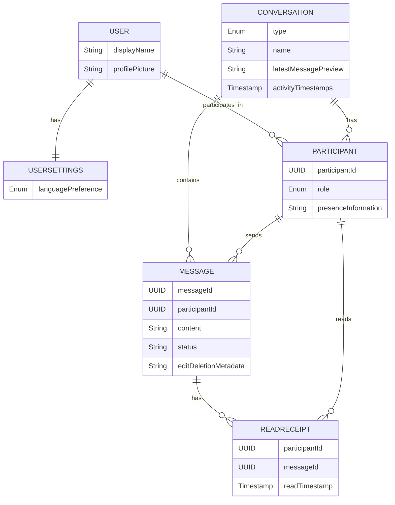

# Overview
## Scope
Mobile client for 1-to-1 and group conversations with text.
## Out-of-scope
- attachments
- reactions
- channels
- backend requirements

# Business requirements

## Chat management

### Capabilities
- Users can see list of their chats
- Users can create a new 1-to-1 chat with other user
- Users can create a group chat with multiple users
- Users can delete a chat
- Users can join an existing group chat
- Users can leave a group chat

### Rules
- Only one 1-to-1 conversation may exist between two users.
- Chats must be ordered by most recent message.
- Group chats must have a name.
- Group chats must have at least two participants.

## Chat

### Capabilities
- Users can read messages
- Users can create messages
- Users can see who sent a message and when.
- Users can see read receipts
- Users can reply to the message
- Users can see when a message failed to send
- Users can retry sending a failed message
- Users must see the same messages on all devices associated with their account.

### Rules
- Messages must not be blank.
- Message text must be less than or equal to 2000 characters.
- Users must not be identifiable across different conversations. Participant identifiers in one conversation must not allow correlation with the same user in any other conversation.

## Group chat administration

### Capabilities
- The user who creates a group chat becomes its admin.
- Admins can promote participants to moderator or admin.
- Admins can remove participants from a group chat.
- Moderators can remove non-admin participants from a group chat.

### Rules
- A group chat must always have at least one admin.
- Only admins can change the group chat name.

## Message modification

### Capabilities
- Users can edit own messages
- Users can see when a message was edited
- Users can delete own messages
- In group chats, admins and moderators can delete any participant's messages.

## Offline capabilities

### Capabilities
- Users can read, create, edit messages offline

## Privacy

### Rules
- Only participants of a conversation must be able to access its messages
- Users' communications circle and usage patterns must not be exposed or inferable to other users or external observers through the application.

## User profile

### Capabilities
- Users must login to account to use the application
- User can create an account
- Users must enter profile name
- Users can edit profile name
- Users can set picture for a profile
- Users can edit picture for a profile

## Localization

### Capabilities
- Users can select UI language between English and German

# UX requirements

## Chat management

### Chats list
- Each chat in the chat list must display a preview of the latest message.
- Display a loading indicator until chats are loaded.
- Show cached chats if offline and indicate offline status.
- Display an error and retry option if loading fails.
- Chats previews must automatically update when new messages arrive.
- When a new message arrives or is created, the corresponding chat must move to the top of the chat list.
- Chats with unread messages must display a visual unread indicator.
- Chat list updates must not disrupt user interaction with the list.
- When the user has no chats, the interface must display an empty state explaining how to start a conversation.

### Chat creation
- The option to create a new chat must be clearly visible on the same screen with the chat list.
- Users must be able to choose between creating a 1-to-1 chat or a group chat.
- When creating a new chat, users must be able to search for or select participants from a list of available contacts.
- When creating a group chat, users must be able to select multiple participants and provide a group name.
- After a new chat is created, the interface must display the new chat in the chat list and navigate the user to the conversation.
- If a 1-to-1 chat already exists with the selected participant, the interface must notify the user and open the existing chat instead of creating a duplicate.
- If creating a new chat fails (e.g., network error or blocked participant), the interface must display a clear error message and allow the user to retry.

### Chat deletion
- When a chat is deleted, it must immediately disappear from the chat list.
- Users must receive confirmation before deleting a chat.

### Group chat management
- Group chats must display the group name and participant count in the chat list.
- Users must be able to view the list of participants in a group chat.
- Admins must be able to access group settings to change the group name or manage participants.
- When a participant is removed or leaves, remaining participants must see a system indication.
- When a new participant joins, existing participants must see a system indication.

## Chat
- After a message is successfully added to the chat, the input field must be cleared.
- Messages created offline must remain visible in the conversation in a stable position until synchronization completes.
- Messages that fail to be delivered must remain visible in the chat with a failed status.
- Incoming messages must not change the current scroll position when the user is viewing older messages.
- When the user is viewing the latest messages, incoming messages must automatically appear in view.
- When new messages arrive while the user is viewing older messages, the UI must indicate that new messages are available.
- Edited messages must be visibly marked as edited.

## Errors
- Blocking errors must provide a clear explanation of the problem.
- Blocking errors must provide an available action to resolve the issue when possible.
- Only one blocking error should be shown to the user at a time.
- Blocking errors must remain visible until the user explicitly dismisses them.
- Non-blocking errors should not interrupt the user's interaction with the UI.
- User input must not be lost when an error occurs.

## User profile

### Profile display
- The profile screen must display the user's current name and profile picture.
- If no profile picture is set, a placeholder avatar must be displayed.

### Profile edit
- When the user edits the profile name or picture, the change must be visible immediately after a successful save.
- If saving profile changes fails, the entered data must remain visible and the user must be informed.
- While profile changes are being saved, the interface must prevent conflicting edits.
- When profile changes are successfully saved, the interface must provide confirmation.
- Profile name input must show validation feedback when the entered name is invalid.
- When the user selects a new profile picture, the preview must be shown before saving.
- When a user updates their profile name or picture, the change must become visible in chats and message lists without requiring the application to restart.

## Localization
- The option to select a UI language must be clearly accessible in the settings or profile screen.
- When the user selects a new language, the interface must update immediately without requiring an app restart.
- The selected language must persist across app restarts and be applied on all devices associated with the account.
- If a string is not available in the selected language, the interface must display a fallback language (e.g., English) rather than showing an empty or broken string.
- UI must handle different text lengths and formatting correctly for the selected language (e.g., longer words in German must not break layout).

# System requirements
- Messages must have stable unique identities across all devices.
- Messages created by a user must eventually be delivered to recipients unless deleted.
- Messages must appear in a consistent chronological order for all participants
- Messages created or modified on one device must be synchronized to other devices.
- Conflicting updates must be resolved deterministically.
- Users must not see duplicate messages in a conversation
- Message delivery must be idempotent.

## User anonymity across chats
- The system must generate unique participant identifiers for each conversation that cannot be correlated with identifiers in other conversations.
- Any data stored or transmitted must not include global user IDs or other attributes that allow cross-chat correlation.
- Cached messages and participant information must maintain per-conversation anonymity even when stored locally.

# Security requirements

## Authentication
- All API calls must require authentication tokens.
- Tokens must expire and be validated on each request.

## Authorization / Access control
- Only authenticated participants of a conversation can read, send, or edit messages.
- Users must not be able to access conversations they are not a participant of, even via API calls.

## Data protection
- All messages and profile data must be transmitted over encrypted channels (e.g., TLS 1.2+).
- Message data and user profile data must be encrypted at rest.
- Sensitive fields (passwords, tokens) must be hashed or encrypted.

## Input validation
- All user input must be validated and sanitized before processing or storage to prevent injection attacks.

## Logging & auditing
- All failed login attempts, unauthorized access attempts, and message deletion operations must be logged for auditing purposes.

## Session management
- User sessions must expire after inactivity.
- Users must be able to revoke sessions from other devices.

## Data integrity
- Messages must be signed or verified to prevent tampering during storage or transit.

# Data model

## Conceptual Domain Model

### Entities

#### User
Represents an individual using the messaging system. 
Each user has a profile containing a display name and an optional profile picture.

#### UserSettings
User preferences such as UI language.

#### Conversation
Represents a chat session between two or more users. A conversation can be either a 1-to-1 chat or a group chat. Group chats have a name and support admin/moderator roles. Participants' identifiers are unique per conversation and do not allow correlation across different conversations, preserving user anonymity. Each conversation maintains the current state of the chat, including the latest message for preview and ordering purposes. Conversations track activity timestamps to support ordering and synchronization.

#### Message
Represents an individual message within a conversation. Messages include the text content, sender information, status (such as sending, sent, failed, read), and metadata about edits and deletions. Messages have stable identities to support synchronization and retries.

#### ReadReceipt
Represents the event of a participant reading a particular message, including the timestamp when the message was read.

### Relationships

- A User can participate in multiple Conversations.
- A User has one UserSettings configuration.
- A Conversation includes multiple Participants. A 1-to-1 conversation has exactly two; a group conversation has two or more.
- A Conversation contains multiple Messages.
- A Message is sent by one Participant.
- A Message can have multiple ReadReceipts, each associated with a Participant.

# Entity-Relationship Diagram

# Non-functional requirements

## Battery and CPU efficiency
- Background synchronization must consume minimal CPU and battery (<5% CPU over 1 hour).
- Rendering, scrolling, and animations must not cause battery drain spikes.

## Network usage optimization
- The app must batch or debounce updates to minimize unnecessary network requests.

## Memory and storage
- Background storage must scale linearly with message and chat count and avoid exceeding device storage limits.
- Old caches must be cleaned automatically to prevent storage growth.

## Error handling UX
- Errors due to connectivity or offline status must not block message input.
- Failed messages must remain visible and allow retry or editing.

## Chat list

### Load performance
- Chat list must load and display the latest 50 chats within 500 ms.
- Fetching older chats must not block the UI.

### Scroll performance
- Scrolling through 1,000 chats must remain smooth without dropped frames.
- Lazy loading or placeholders must be used for chat previews.

### Offline caching
- Cached chats must remain visible when the device is offline.
- Offline chats must indicate synchronization status.

### Memory and resource usage
- Chat list must not exceed 50 MB of memory on the device.
- Background synchronization must not consume more than 5% CPU over 1 hour.

### Data consistency
- Chat order and unread message counts must remain accurate across restarts and devices.

## Chat

### UI Responsiveness
- Opening a chat must display the latest messages within 500 ms at p95.
- Read receipts must update within 500 ms at p95.
- Scrolling through conversations with 10,000 messages must remain smooth without dropped frames.

### Offline behavior
- Users must be able to read, create, or edit messages offline without delays.
- Offline actions must synchronize automatically within 5 seconds after connectivity is restored.
- Cached chats must remain readable offline, with clear offline indicators.

### Memory and storage
- The app must not consume more than 100 MB of memory while displaying a conversation of 10,000 messages.